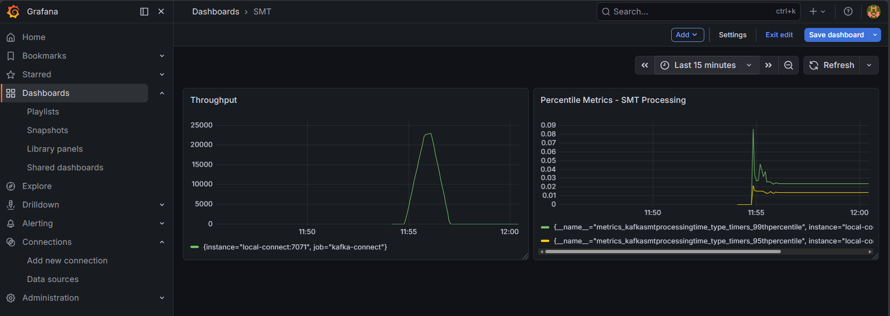

# Kafka Connect SMT Performance Benchmarking (JSON Pipeline)
This repository provides a complete, observable local environment for benchmarking the compute overhead of Single Message Transformations (SMTs) in Kafka Connect.

This project proves the performance impact of deserializing, mutating, and re-serializing unstructured JSON string payloads on the fly using Jackson.

## Architecture Overview
* Message Broker: Confluent Kafka (Local)
* Compute: Kafka Connect (Standalone/Distributed worker)
* Custom SMT: PiiMaskingTransform (Parses JSON, masks PII, injects timestamps, calculates latencies)
* Metrics Engine: Prometheus (Scraping via JMX Java Agent on port 7071)
* Visualization: Grafana (Dashboards for TPS, SMT Latency, End-to-End Latency)

## Prerequisites
* Docker & Docker Compose
* Java 11+ (JDK)
* Gradle (via Wrapper)
* curl

### Step 1: Infrastructure Setup
Start the complete infrastructure suite. This will spin up Kafka, Kafka Connect, Prometheus, and Grafana on the kafka-connect-smt-prometheus_default Docker bridge network.

```Bash
docker compose up -d
```
Wait approximately 60 seconds for the Kafka Connect JVM to fully initialize the JMX agent. Verify the Connect REST API is up:

```Bash
curl -s http://localhost:8083/ | grep version
```

### Step 2: Testing
The core SMT logic is located in src/main/java/com/yuktitechnologies/PiiMaskingTransform.java. Whenever you modify the transformation logic, always run the unit tests to ensure the JSON string contract remains intact:

```Bash
./gradlew clean test
```

### Step 3: Deployment Automation (deploy.sh)
To streamline rebuilding and deploying the Fat JAR to the Connect worker, create a file named deploy.sh in the root of your project with the following contents:

```Bash
#!/bin/bash
echo "==> Cleaning and Building Fat JAR..."
./gradlew clean build shadowJar

echo "==> Copying JAR to plugins directory..."
cp ./build/libs/pii-masking-smt-*-fat.jar ./plugins/

echo "==> Restarting Kafka Connect container..."
docker compose restart local-connect

echo "==> Waiting for Kafka Connect API to become available..."
while [[ "$(curl -s -o /dev/null -w ''%{http_code}'' http://localhost:8083/)" != "200" ]]; do
sleep 5
echo "Waiting..."
done

echo "==> Deployment Complete!"
```

Make the script executable and run it:

```Bash
chmod +x deploy.sh
./deploy.sh
```

### Step 4: Configure the Connector
Because this benchmark simulates raw JSON strings arriving from upstream, you must use the StringConverter so the SMT receives raw text to parse via Jackson.

Register or update the connector using the Kafka Connect REST API:

```Bash
curl -X DELETE http://localhost:8083/connectors/local-pii-connector

curl -X POST http://localhost:8083/connectors   -H "Content-Type: application/json"    -d '{
"name": "local-pii-connector",
"config": {
"connector.class": "org.apache.kafka.connect.file.FileStreamSinkConnector",
"tasks.max": "1",
"topics": "json-test-topic",
"file": "/tmp/masked-output.txt",
"value.converter": "org.apache.kafka.connect.storage.StringConverter",
"key.converter": "org.apache.kafka.connect.storage.StringConverter",
"transforms": "piiMasking",
"transforms.piiMasking.type": "com.yuktitechnologies.PiiMaskingTransform",
"errors.tolerance": "all",
"errors.log.enable": "true",
"errors.log.include.messages": "true"
}
}'
```

Verify the connector is RUNNING:

```Bash
curl -s http://localhost:8083/connectors/local-pii-connector/status
```

### Step 5: Generate Load
Run the high-throughput load generator from your IDE or via command line. The JsonLoadGenerator.java uses micro-batching to bypass OS thread scheduling limits, and simulates network jitter alongside fat records, easily pushing 25,000+ TPS.

Ensure the generator targets the json-test-topic.

### Step 6: Observability & Grafana
Once the load generator is running, data will flow into Prometheus and become visible in Grafana.

1. Connect Grafana to Prometheus
   * Open Grafana at http://localhost:3000 (admin/admin). 
   * Go to Connections > Data Sources > Add Data Source. 
   * Select Prometheus. 
   * Set the URL to the internal Docker network hostname: http://local-prometheus:9090. 
   * Click Save & Test.

2. Configure Benchmark Dashboards
   * Create a new dashboard with Time Series panels using the following PromQL queries. Set the Min Step to 15s and the Legend to {{id}}. 
     * A. Throughput (Messages/Sec)
       * Query: rate(metrics_kafkasmtprocessingtime_type_timers_count[1m])
       * Unit: Short 
     * B. SMT Processing Overhead (P95 vs P99)
       * Description: Visualizes the baseline computational cost of parsing against the GC tail latency caused by fat records. 
       * Query A (P95 Baseline): metrics_kafkasmtprocessingtime_type_timers_95thpercentile 
       * Query B (P99 Tail Latency): metrics_kafkasmtprocessingtime_type_timers_99thpercentile 
       * Unit: Time > Milliseconds (ms)
       * 


### Step 7: Benchmark Results (Local Profile)
* Target Load: ~25,000 TPS
* Average Throughput Achieved: ~24,000
* Average SMT Latency (P95 Baseline): ~15 ms
* Average Tail Latency (P99 GC Impact): ~25 ms to 85 ms

## Troubleshooting
* Prometheus Target is DOWN: Check http://localhost:9090/targets. 
* If local-connect is down, ensure the JMX Java Agent in docker-compose.yml (KAFKA_OPTS) is bound to port 7071 and Prometheus is scraping the correct Docker hostname (local-connect:7071). 
* Grafana shows "No Data": Ensure your time range is set to "Last 15 minutes" or click the "Instant" query toggle to verify the data connection. 
* SMT Throws Exception: If the SMT throws a [DATA_VALIDATION_ALERT], you likely left the value.converter as JsonConverter instead of StringConverter. Check your connector config. 
* Task Fails on "Tolerance exceeded": If a malformed message crashes the connector, ensure "errors.tolerance": "all" is set in your connector configuration to automatically route poison pills to the logs instead of crashing the task.